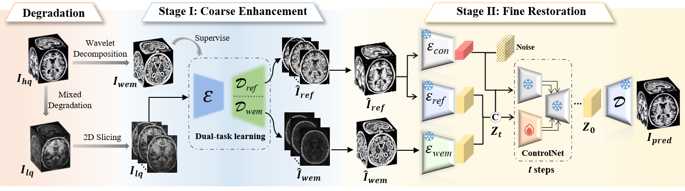

# UniDiff-MR: A Unified Diffusion-based Framework for Comprehensive Enhancement of Multi-Degraded 3D Brain MRI



> **Abstract:** Magnetic Resonance Imaging (MRI) acquired in clinical practice often contains mixed degradations, including noise, motion artifacts, and intensity inhomogeneity, which interact nonlinearly and severely impair anatomical visibility. Existing enhancement methods are typically designed for a single degradation type or operate on 2D slices, limiting their effectiveness when degradations coexist and when volumetric consistency is required. To address these challenges, we propose UniDiff-MR, a unified diffusion-based framework for comprehensive enhancement of multi-degraded 3D brain MRI. UniDiff-MR adopts a coarse-to-fine design. A dual-supervised spatial–frequency-aware coarse enhancement module leverages wavelet energy maps to suppress diverse degradations while preserving global anatomical structures. Building on this foundation, a 3D conditional diffusion refinement stage incorporates predicted energy maps as anatomy-aware priors to progressively restore fine details and enforce cross-slice structural coherence. This design mitigates the smoothing effects of fully supervised coarse models and reduces the risk of anatomically inconsistent synthesis in diffusion-based refinement. Extensive experiments on public datasets and multi-center real-world cohorts demonstrate that UniDiff-MR consistently outperforms single-stage, degradation-specific, and 2D-based approaches in image quality, robustness, and downstream task performance. These results highlight UniDiff-MR as a principled and generalizable solution for enhancing multi-degraded MRI in realistic clinical environments.

## Project Structure
This repository contains the official implementation of the two-stage UniDiff-MR framework. The code is organized as follows:

```
code/
├── config/                 # Configuration files for training and inference
├── dataset/               # Data loading and preprocessing scripts
├── models/                # Model definitions (coarse module, diffusion model)
├── project/               # Core training and inference logic
├── utils/                 # Utility functions (metrics, visualization, etc.)
├── diffusion.pt           # Pretrained diffusion model weights (if provided)
├── img/                   # Directory for article realted picture
├── psnr_ssim_3D.py        # Script for calculating 3D image quality metrics
├── test_stage1.py         # Inference script for Stage-1 (coarse enhancement)
├── test_stage2.py         # Inference script for Stage-2 (diffusion refinement)
├── train_stage1.py        # Training script for Stage-1
├── train_stage2.py        # Training script for Stage-2
├── requirements.txt       # Python dependencies
├── .gitignore             # Git ignore file
└── README.md              
```

## Installation
* Clone this repository
```bash
git clone https://github.com/LSYLAB/UniDiff-MR.git
cd code
```

* Install the required dependencies
```bash
pip install -r requirements.txt
```

* Running the Model

The framework operates in two sequential stages: Coarse Enhancement​ and Diffusion Refinement.
1. Stage-1: Coarse Enhancement
* Training:
```bash
python train_stage1.py --config_path ./config/train_stage1.yaml codeformer
```
* Testing/Inference:
```bash
python test_stage1.py --config_path ./config/test_stage1.yaml
```
2. Stage-2: Diffusion Refinement
* Training:​ 

This stage relies on outputs and energy maps from the trained Stage-1 model.
```bash
python train_stage2.py --config_path ./config/train_stage2.yaml codeformer_3D
```
* Testing/Inference:
```bash
python test_stage2.py --config_path ./config/test_stage2.yaml
```